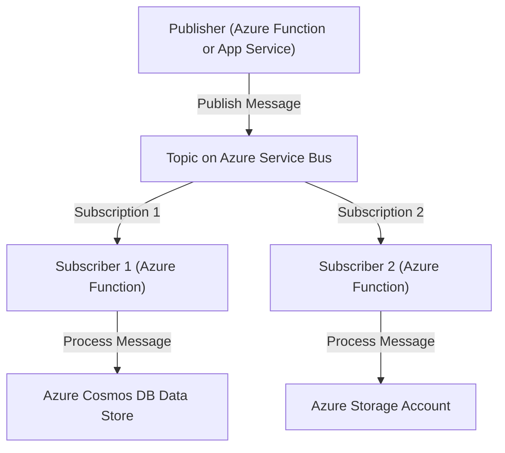

# Azure Publisher-Subscriber Pattern Implementation

This repository demonstrates how to implement the **Publisher-Subscriber Pattern** using Azure services, including Azure Service Bus, Azure Functions, Azure Cosmos DB, and Azure Storage Account. The project includes Bicep templates for infrastructure deployment, Python code for the publisher and subscribers, and GitHub Actions workflows for continuous integration and deployment.

## 🏗️ Architecture Overview



### Components of the Architecture

1. **Publisher**: An Azure Function or App Service that simulates an online webshop by sending order details (such as what items have been ordered) to an Azure Service Bus topic.
2. **Azure Service Bus**: A messaging backbone where the publisher sends messages to a specific topic. The topic has two subscriptions (`Subscription 1` and `Subscription 2`), each representing a different message processing pathway.
3. **Subscriber 1**: An Azure Function that listens to messages from **Subscription 1** on the Azure Service Bus topic and processes them by storing the order details in **Azure Cosmos DB**.
4. **Subscriber 2**: An Azure Function that listens to messages from **Subscription 2** on the Azure Service Bus topic and processes them by storing the order details as JSON files in an **Azure Storage Account**.

## 📑 Folder Structure

- **`/infrastructure`**: Contains the Bicep template for deploying Azure resources and the GitHub Action for automating the deployment.
- **`/publisher`**: Contains the Python code for the publisher service and a GitHub Action to deploy it.
- **`/subscriber1`**: Contains the Python code for Subscriber 1 (processing messages to Cosmos DB) and a GitHub Action to deploy it.
- **`/subscriber2`**: Contains the Python code for Subscriber 2 (processing messages to Storage Account) and a GitHub Action to deploy it.

## 📝 How the Architecture Works

### Publisher

- The **Publisher** (an Azure Function or App Service) sends messages to a topic on **Azure Service Bus**.
- Each message contains details of an order placed in a simulated webshop, such as:

  ```json
  {
      "orderId": "12345",
      "customerName": "John Doe",
      "items": ["Laptop", "Smartphone", "Headphones"]
  }
  ```

- The publisher sends these messages to a specific **Service Bus topic**.

### Azure Service Bus

- **Azure Service Bus** acts as a messaging backbone. Messages published by the **Publisher** are sent to a **topic**.
- The topic has two **subscriptions**:
  - **Subscription 1**: Routes messages to **Subscriber 1**.
  - **Subscription 2**: Routes messages to **Subscriber 2**.

### Subscriber 1

- **Subscriber 1** is an Azure Function that listens to messages from **Subscription 1** on the Service Bus topic.
- It processes each message by extracting the order details and stores them in **Azure Cosmos DB**. This allows for efficient querying and retrieval of order data.
- For example, when a message is received:
  - The function extracts details like `orderId`, `customerName`, and `items`.
  - It then upserts this data into the specified Cosmos DB container.

### Subscriber 2

- **Subscriber 2** is an Azure Function that listens to messages from **Subscription 2** on the Service Bus topic.
- It processes each message by extracting the order details and stores them as JSON files in an **Azure Storage Account**. This is useful for logging, auditing, or further batch processing.
- For example, when a message is received:
  - The function extracts details like `orderId`, `customerName`, and `items`.
  - It then creates or updates a blob (JSON file) in the specified Azure Blob Storage container.

## 🛠️ How to Start

### Prerequisites

1. **Azure Subscription**: An active Azure account.
2. **Azure CLI**: Installed and configured.
3. **GitHub Repository**: Clone this repository to your local machine.

### Steps to Deploy

1. **Deploy Infrastructure**:
   - Navigate to the `/infrastructure` folder.
   - Run the GitHub Action to deploy the Bicep template.

2. **Deploy the Publisher**:
   - Navigate to the `/publisher` folder.
   - Run the GitHub Action to deploy the Publisher service.

3. **Deploy the Subscribers**:
   - Navigate to the `/subscriber1` and `/subscriber2` folders.
   - Run the respective GitHub Actions to deploy the Subscriber services.

### Testing the Workflow

1. **Send a Message to the Publisher**:
   - Use an HTTP client (such as Postman or `curl`) to send a POST request to the publisher Azure Function endpoint (`/publishOrder`).
   - Example request:

   ```bash
   curl -X POST https://<your-function-app-name>.azurewebsites.net/api/publishOrder \
   -H "Content-Type: application/json" \
   -d '{
       "orderId": "12345",
       "customerName": "John Doe",
       "items": ["Laptop", "Smartphone", "Headphones"]
   }'
   ```

2. **Monitor Subscribers**:
   - Go to the **Azure portal** to check the logs and monitor the executions of Subscriber 1 and Subscriber 2.

## 🔧 Additional Configuration

### Service Bus Connection String

- The **Service Bus connection string** (`ServiceBusConnection`) is configured in the app settings of the Azure App Service (Publisher) and all Azure Function Apps. This connection string is used to authenticate and connect to the Azure Service Bus namespace where messages are published and consumed.

### Application Insights

- **Application Insights** is configured to monitor and collect logs for all the services (Publisher and Subscribers). This enables you to view logs, metrics, and other telemetry data for your services in the Azure portal under the **Application Insights** resource.

## 📊 Monitoring and Logging

- You can monitor the health, performance, and activity of your services by navigating to the **Application Insights** resource in the Azure portal.
- Logs from the **Publisher** and **Subscribers** are automatically collected and available in **Application Insights**.

## 🛠️ How to Deploy the Infrastructure

To deploy the infrastructure with the updated configurations:

1. **Navigate to the `/infrastructure` folder**.
2. **Run the GitHub Action** to deploy the updated Bicep template, which now includes the Application Insights and correct Service Bus configuration.

## 📄 License

This project is licensed under the MIT License - see the [LICENSE](LICENSE) file for details.
